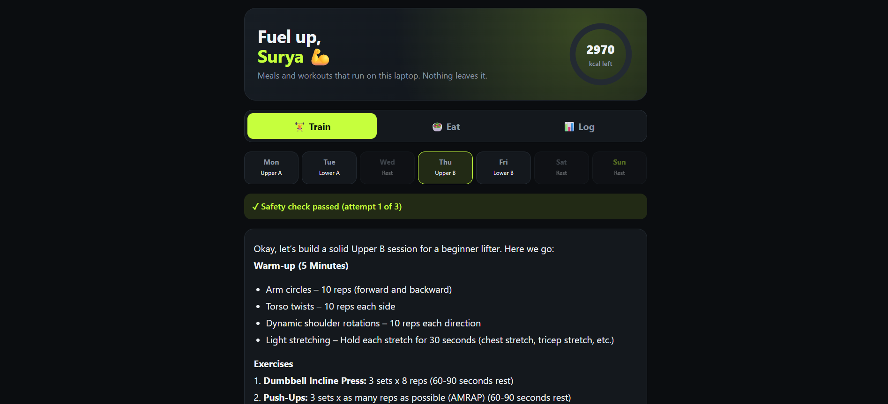
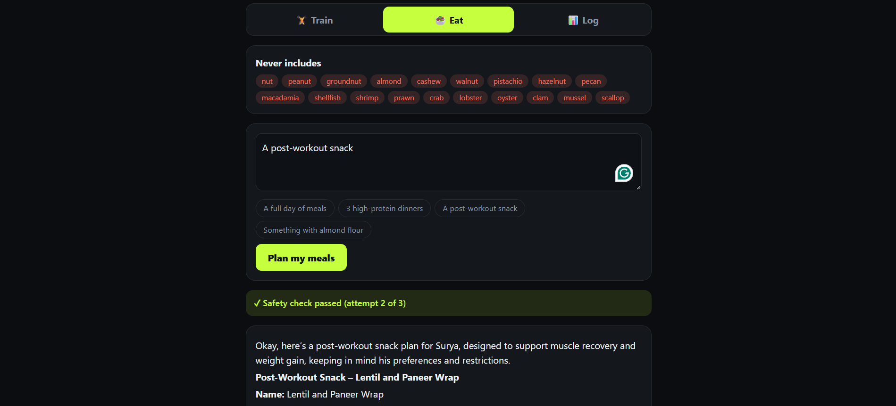
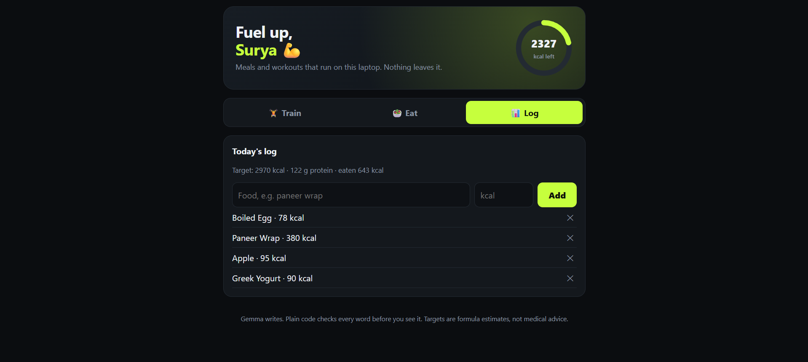
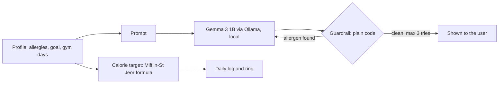

<div align="center">

# 🏋️ PlateAndPlate

### A gym meal and workout planner that can't sneak an allergen past you.
Runs on your own laptop with an open model. No account, no cloud, no per-request cost.

  -c6ff3d) 



</div>

---

## Why this exists

I built PlateAndPlate for my cousin, who is starting a gym routine and has **severe nut and shellfish allergies**. Most meal and fitness apps suggest almond-crusted everything and don't know what he can't eat. PlateAndPlate plans his meals and workouts, counts his calories, and **checks every plan for his allergens before he sees it.**

## What it does

| | |
|---|---|
| 🏋️ **Train** | A weekly split (set by gym days per week). Tap a day and Gemma writes that session: warm-up, exercises, sets, reps, rest. |
| 🥗 **Eat** | Ask for meals in plain language, such as "3 high-protein dinners". Plans include approximate calories and protein. |
| 📊 **Log** | A daily calorie counter with a ring that fills as you log food. |
| 🛡️ **Guard** | Every meal plan is scanned for allergens, every workout for banned exercises, in plain code. Unsafe drafts are thrown away and regenerated. |

<p align="center">
 
</p>

## How it works



**The AI suggests. Code decides.**

- **The guardrail is not a prompt.** Output is normalised first (NFKC, zero-width characters removed), so `pea​nut` and `ｐｅａｎｕｔ` still count as "peanut". A banned word means the draft is discarded and regenerated, up to 3 times, then refused.
- **The calorie target comes from a formula**, not the model. A 1B model can't look up real food data.
- **The weekly split is fixed in code.** Gemma only fills in one session at a time, which keeps requests short and the structure reliable.
- **Sessions are whitelisted** and the server only answers requests addressed to `127.0.0.1` or `localhost`.

## Run it

You need [Python 3](https://python.org) and [Ollama](https://ollama.com).

```bash
ollama pull gemma3:1b
python test_guard.py     # guardrail tests
python app.py            # then open http://127.0.0.1:8000
```

Use `python3` instead of `python` on Mac or Linux. Nothing to `pip install`.

### Make it yours

Edit `profile.json`:

| Field | Meaning |
|---|---|
| `avoid` | Allergens and related words, checked in every meal plan |
| `avoid_exercises` | Movements to keep out of workouts (injuries, etc.) |
| `goal` | `cut`, `maintain` or `gain` |
| `gym_days` | 2 to 6 sessions a week |
| `age`, `sex`, `height_cm`, `weight_kg`, `activity` | Used for the calorie target |

## Honest limits

- The calorie and protein **targets are formula estimates**, and the per-meal numbers from the model are **rough guesses**. This is not medical advice.
- The guard checks **words, not ideas**. If an ingredient isn't on the `avoid` list (or a synonym is missing), it won't be caught. Always read labels and double-check meals.
- A 1B model is small. Plans are decent, not perfect, and each request takes a while on a CPU-only laptop.

## Why open models

For a person's health details, local matters: allergies and eating habits stay on the laptop, there's no cost per request, it works offline, and the model version is pinned so it can't change behaviour overnight. Wrapping a hard safety check around the model is also much easier when you control the model.

## Built with

Python standard library · [Ollama](https://ollama.com) · [Gemma 3](https://ai.google.dev/gemma) (provided under the [Gemma Terms of Use](https://ai.google.dev/gemma/terms)) · plain HTML/CSS/JS

Built for the **Hacktoberfest Weekend Challenge: Build for a Friend** (Oct 2-5, 2026) with AI coding assistance. I directed it, reviewed the code and ran it myself.
